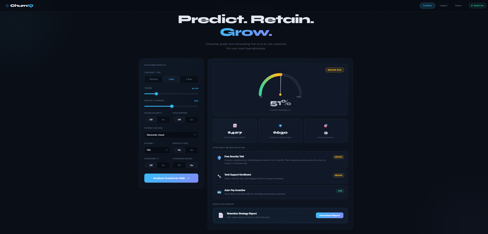
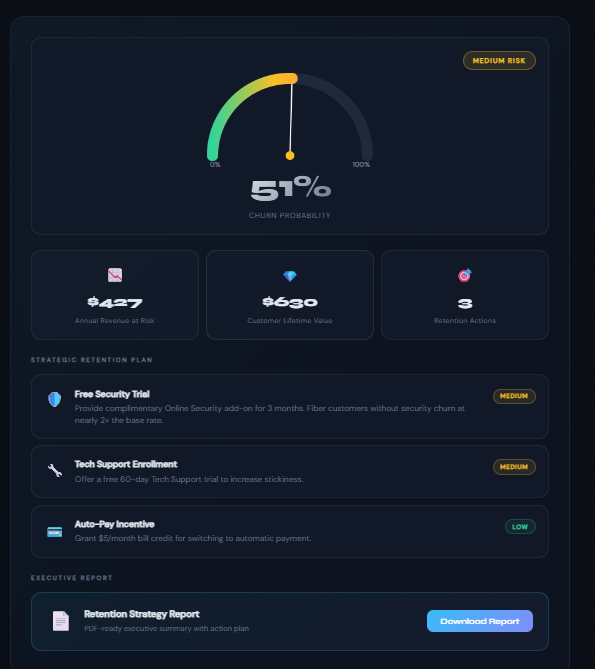
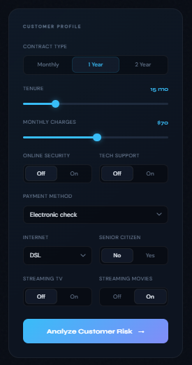

# ChurnIQ v3.0 — Customer Churn Intelligence Platform

> A production-ready FastAPI application with a premium dark-themed dashboard powered by a scikit-learn ML pipeline to predict and prevent customer churn.

---

## 📋 Table of Contents

- [Overview](#overview)
- [Features](#features)
- [Project Structure](#project-structure)
- [Tech Stack](#tech-stack)
- [Getting Started](#getting-started)
- [API Reference](#api-reference)
- [Model Details](#model-details)
- [Retraining the Model](#retraining-the-model)
- [Contributing](#contributing)

---

## Overview

ChurnIQ helps telecom businesses identify customers at risk of churning before it's too late. Input a customer's profile and instantly receive:

- **Churn probability score** with a visual risk gauge
- **Risk classification** — Low / Medium / High
- **Annual revenue at risk** and CLV estimate
- **Personalized retention recommendations** with impact ratings
- **One-click executive report** download

---


## Dashborad
ChurnIQ helps telecom businesses identify customers at risk...

## Gauge metrics

## Customers Profile 



## ✨ Features

| Feature | Description |
|---|---|
| 🎯 ML Prediction | Continuous churn probability via `predict_proba` |
| 📊 Risk Tiers | LOW < 30% · MEDIUM 30–65% · HIGH > 65% |
| 💡 Smart Recommendations | Rule-based retention strategies with impact levels |
| 🎨 Premium Dark UI | Animated blobs, noise texture, Syne + DM Sans fonts |
| 📈 Interactive Gauge | Canvas-drawn animated risk meter |
| 📄 Report Export | One-click `.txt` executive report download |
| 🔍 Health Monitor | Live API status indicator in footer |
| ⚡ Business Logic | Fiber/no-security correction layer for accurate scores |

---

## 📁 Project Structure

```
churn_project/
├── app/
│   └── main.py                 ← FastAPI backend + prediction API (v3.0)
├── data/
│   └── Telco-Customer-Churn.csv
├── models/
│   └── churn_pipeline.pkl      ← Pre-trained scikit-learn ML pipeline
├── static/
│   ├── css/
│   │   └── style.css           ← Premium dark UI styles
│   └── js/
│       └── app.js              ← Frontend logic, gauge, animations
├── templates/
│   └── index.html              ← Main dashboard template (Jinja2)
├── retrain_model.py            ← Full model retraining script
├── smote_training_variant.py   ← SMOTE variant for class imbalance
├── test_medium_risk.py         ← Test cases for medium-risk profiles
├── requirements.txt
└── README.md
```

---

## 🛠 Tech Stack

**Backend**
- [FastAPI](https://fastapi.tiangolo.com/) — high-performance async API framework
- [Uvicorn](https://www.uvicorn.org/) — ASGI server
- [scikit-learn](https://scikit-learn.org/) — ML pipeline & model
- [imbalanced-learn](https://imbalanced-learn.org/) — SMOTE for class imbalance
- [Pandas](https://pandas.pydata.org/) / [NumPy](https://numpy.org/) — data processing
- [Joblib](https://joblib.readthedocs.io/) — model serialization

**Frontend**
- Jinja2 templating
- Vanilla JS + Canvas API (animated gauge)
- Custom CSS (dark theme, animated blobs)

---

## 🚀 Getting Started

### Prerequisites
- Python 3.8+
- pip

### 1. Clone or unzip the project

```bash
unzip churn_project.zip
```

### 2. Create a virtual environment

```bash
python -m venv venv
```

Activate it:

```bash
# macOS / Linux
source venv/bin/activate

# Windows
venv\Scripts\activate
```

### 3. Navigate into the project folder

```bash
cd churn_project
```

### 4. Install dependencies

```bash
pip install -r requirements.txt
```

### 5. Start the server

```bash
uvicorn app.main:app --reload --host 0.0.0.0 --port 8000
```

### 6. Open in your browser

```
http://localhost:8000
```

> ⚠️ Run `uvicorn` from **inside** the `churn_project/` folder so it can resolve the `templates/`, `static/`, and `models/` directories correctly.

---

## 🔌 API Reference

### `GET /`
Returns the main dashboard HTML UI.

---

### `GET /health`
Returns API health status.

**Response:**
```json
{ "status": "ok" }
```

---

### `POST /predict`
Runs churn prediction on a customer record.

**Request Body:**

```json
{
  "gender": "Male",
  "SeniorCitizen": 0,
  "Partner": "No",
  "Dependents": "No",
  "tenure": 12,
  "PhoneService": "Yes",
  "MultipleLines": "No",
  "InternetService": "DSL",
  "OnlineSecurity": "No",
  "OnlineBackup": "No",
  "DeviceProtection": "No",
  "TechSupport": "No",
  "StreamingTV": "No",
  "StreamingMovies": "No",
  "Contract": "Month-to-month",
  "PaperlessBilling": "Yes",
  "PaymentMethod": "Electronic check",
  "MonthlyCharges": 70.0,
  "TotalCharges": 840.0
}
```

**Response:**

```json
{
  "churn_probability": 0.74,
  "risk_level": "High",
  "annual_revenue_at_risk": 621.60,
  "clv_estimate": 840.0,
  "recommendations": [
    {
      "icon": "📋",
      "title": "Contract Upgrade",
      "detail": "Offer 15% discount to switch to a 1-year or 2-year contract.",
      "impact": "High"
    }
  ]
}
```

**Risk Thresholds:**

| Risk Level | Churn Probability |
|---|---|
| 🟢 Low | < 30% |
| 🟡 Medium | 30% – 65% |
| 🔴 High | > 65% |

---

## 🧠 Model Details

The `churn_pipeline.pkl` is a scikit-learn `Pipeline` trained on the [IBM Telco Customer Churn dataset](https://www.kaggle.com/datasets/blastchar/telco-customer-churn).

**Input features (19 total):**

| Type | Features |
|---|---|
| Numeric | `SeniorCitizen`, `tenure`, `MonthlyCharges`, `TotalCharges` |
| Categorical | `gender`, `Partner`, `Dependents`, `PhoneService`, `MultipleLines`, `InternetService`, `OnlineSecurity`, `OnlineBackup`, `DeviceProtection`, `TechSupport`, `StreamingTV`, `StreamingMovies`, `Contract`, `PaperlessBilling`, `PaymentMethod` |

**Key improvements in v3.0:**
- Uses `predict_proba` for continuous risk scores (vs binary `predict`)
- Business-rule correction layer boosts scores for fiber/no-security customers
- Feature engineering mirrored between training and inference
- Audit log entry returned per prediction

---

## 🔄 Retraining the Model

To retrain the pipeline from scratch using the bundled dataset:

```bash
python retrain_model.py
```

To use SMOTE oversampling for handling class imbalance:

```bash
python smote_training_variant.py
```

To run test cases for medium-risk customer profiles:

```bash
python test_medium_risk.py
```

---

## 🤝 Contributing

1. Fork the repository
2. Create a feature branch (`git checkout -b feature/your-feature`)
3. Commit your changes (`git commit -m 'Add your feature'`)
4. Push to the branch (`git push origin feature/your-feature`)
5. Open a Pull Request

---

## 📄 License

This project is for educational and demonstration purposes using the IBM Telco Customer Churn dataset.
